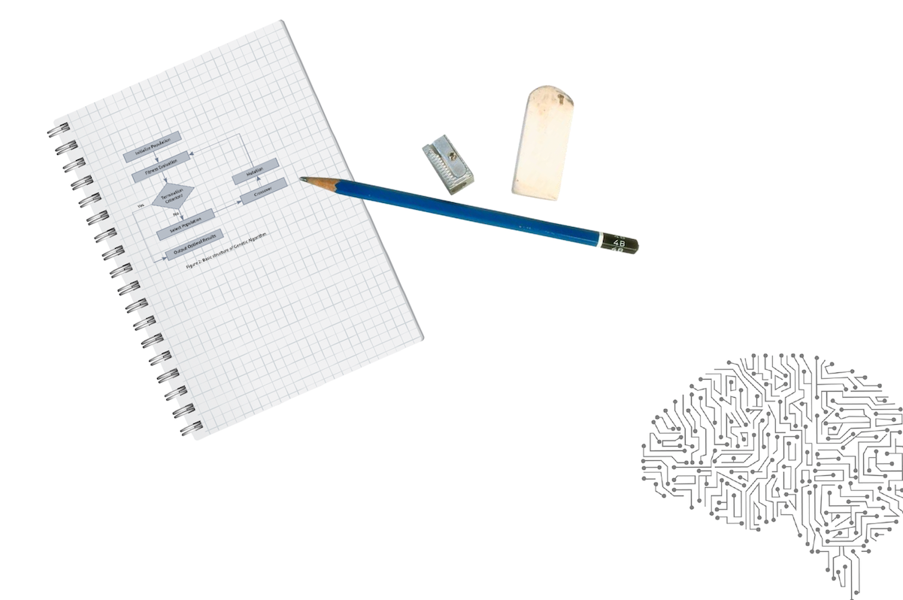

# 📖 En classe de terminale

  
<i>Détails</i>

  
  >__« Dans la nouvelle économie, l’informatique n’est plus une connaissance optionnelle. C’est une compétence basique, comme la lecture, l’écriture et l’arithmétique. »__
  >
  >_Barack Obama, 2016_

  ### Le programme Officiel
  >[Programme de l'enseignement de spécialité de NSI](https://cache.media.education.gouv.fr/file/SPE8_MENJ_25_7_2019/93/3/spe247_annexe_1158933.pdf)  
  >_Bulletin officiel de l'éducation nationale spécial n°8 du 25 juillet 2019_
  
  Cet enseignement s’appuie sur quatre concepts fondamentaux :
  - Les **données**, qui représentent sous une forme numérique unifiée des informations très diverses : textes, images, sons, mesures physiques, sommes d’argent, etc.
  - Les **algorithmes**, qui spécifient de façon abstraite et précise des traitements à effectuer sur les données à partir d’opérations élémentaires.
  -  Les **langages**, qui permettent de traduire les algorithmes abstraits en programmes textuels ou graphiques de façon à ce qu’ils soient exécutables par les machines.
  - Les **machines**, et leurs systèmes d’exploitation, qui permettent d’exécuter des programmes en enchaînant un grand nombre d’instructions simples, assurant la persistance des données par leur stockage, et de gérer les communications. On y inclut les objets connectés et les réseaux.  
  À ces concepts s’ajoute un élément transversal : les **interfaces** qui permettent la communication avec les humains, la collecte des données et la commande des systèmes.

  En classe de terminale, le programme de NSI est découpé en 5 chapitres
  - Les **structures de données** (piles, files, arbres, graphes)
  - Les **bases de données** (modèle relationnel, SGBD, SQL)
  - Les **architectures**, OS et réseaux (composants, processus, routage et sécurité réseau)
  - Les **langages** et la programmation (récursivité, mise au point, bugs, POO)
  - Les **algorithmes** (parcours, diviser pour régner, recherche textuelle)  

  Un chapitre **Histoire de l'informatique** s'ajoute à ceux-ci mais il sera traité de manière transversalle tout au long des cours de première et terminale.
  
  ### La répartition des cours 
  >🕦 _6 heures de cours répartis en 3 blocs de 2 heures_    

  La majorité des cours et TP se font sur machine, il n'y a pas de répartition standard de ces 6 heures entre les cours et les TPs, les cours contiendront des exercices de compréhension et peuvent s'étaler sur 1/2 séance (1h) ou plusieurs séances (2 x 2 heures) les TPs s'étalent souvent sur 2 séances (4h).  
  Pour bien préparer le baccalauréat dont les 3/4 de la note sont obtenus à l'écrit, nous effectuerons des exercices sur feuille sans l'accès aux machines (souvent piochés dans les annales des années précédentes).

  **📝 Les évaluations**  
  - Devoirs surveillés (QCM + exos)
  - Exos type bac
  - Devoirs maison
  - Bac blanc (écrit et pratique)
  - Activités en classe notées
  
  **✓ Les besoins**  
  - Une clé **USB** ou un drive pour sauvegarder vos cours et TP que vous aurez modifiés
  - Des **écouteurs** avec une prise Jack 3.5mm mâle pour pouvoir écouter des vidéos parfois intégrées au cours
  - Connaître ses accès à l'**ENT** et **Pronote**
  
  **⚠️ Les règles** 
  - Etre à l’heure : une tolérance de 5mn, au delà le cours n'est plus accessible
  - Poser son téléphone dans la PhoneBox à son arrivée en classe
  - Passer aux toilettes avant ou après le cours, pas de sortie pendant le cours
  - Respecter ses camarades et le professeur 
  - Respecter le matériel qui est notre outil de travail
  
  **🛠️ Les outils**  
    
  
  **Mais aussi...**  
  
  

---

# 🎓 Le baccalauréat  

  
<i>Détails</i>

  >[Définition  de  l'épreuve  terminale  de  l'enseignement  de  spécialité  « numérique  et  sciences informatiques » du baccalauréat général](https://eduscol.education.fr/document/52908/download#:~:text=L'%C3%A9preuve%20terminale%20obligatoire%20de,est%20donn%C3%A9e%20sur%2020%20points)  
  >_Site Eduscol_
  >
  >[Modification de certaines modalités de passation des épreuves terminales d’enseignements de spécialité](https://www.education.gouv.fr/bo/2023/Hebdo36/MENE2317750N)  
  >_Bulletin officiel de l'éducation nationale n°36 du 28 septembre 2023_

  ### 🖊️ Épreuve écrite  
  _sur 20 points - durée 3 h 30 - coeff 0.75_
  >[Programme d'examen des épreuves terminales des enseignements de spécialité](https://www.education.gouv.fr/bo/22/Hebdo36/MENE2227884N.htm)  
  >_Bulletin officiel de l'éducation nationale n°36 du 30 septembre 2022_

  Depuis la session 2023, l'épreuve consiste en trois exercices qui doivent tous être traités.  

  _Les annales des sujets précédents (2020, 2021, 2022) comportent tous 5 exercices dont seulement 3 devaient être traités. Ce n'est plus le cas depuis la session 2023 où la totalité du sujet doit être traité_

  ### 💻 Épreuve pratique  
  _sur 20 points - durée 1 h - coeff 0.25_  
  >[Partie pratique de l’épreuve de l’enseignement de NSI à compter de la session 2024](https://www.education.gouv.fr/bo/2024/Hebdo8/MENE2330918N)  
  >_Bulletin officiel de l'éducation nationale n°8 du 22 février 2024_

  
  La partie pratique consiste en la résolution de deux exercices sur ordinateur.
  Le candidat est évalué sur la base d’un dialogue avec un professeur-examinateur. Un examinateur évalue au maximum quatre élèves. L’examinateur ne peut pas évaluer un élève qu’il a eu en classe durant l’année en cours.  
  
  **Premier exercice** : Le premier exercice consiste à programmer un algorithme figurant explicitement au programme, ne présentant pas de difficulté particulière, dont on fournit une spécification. Il s’agit donc de restituer un algorithme rencontré et travaillé à plusieurs reprises en cours de formation. Le sujet peut proposer un jeu de test avec les réponses attendues pour permettre au candidat de vérifier son travail.  
  
  **Deuxième exercice** : Pour le second exercice, un programme est fourni au candidat. Cet exercice ne demande pas l’écriture complète d’un programme, mais permet de valider des compétences de programmation suivant des modalités variées : le candidat doit, par exemple, compléter un programme « à trous » afin de répondre à une spécification donnée, ou encore compléter un programme pour le documenter, ou encore compléter un programme en ajoutant des assertions, etc.  
  
  **Banque d'exercices** : Les exercices des épreuves pratiques jusqu'à 2023 sont disponibles sur le site [Eduscol](https://eduscol.education.fr/2661/banque-des-epreuves-pratiques-de-specialite-nsi)  

  ### A noter 
  - _Les deux épreuves n'auront pas lieu le même jour._  
  - _Les notes de l'épreuve de terminale compteront pour le baccalauréat avec le coefficient 16 sur 60._   
  - _La note sur 20 au baccalauréat en NSI est constituée de 15 points d'épreuve écrite et de 5 points d'épreuve pratique._  

    

---

# 💻 Notre environnement de travail

  
<i>Détails</i>
  

  ### Jupyter Notebook
  Tous les cours et TP de cette année seront disponibles en ligne sur __Github__ à l'adresse https://github.com/abrugiere/tnsi sous forme de __Notebooks Jupyter__.  
  Jupyter Notebook est un environnement de programmation interactif permettant de créer des document intitulés "notebooks". Il s'agit de documents se présentant sous la forme d'une succession de cellules qui peuvent contenir du code __Python__, du __texte brut__, des formules mathématiques, des graphiques ou encore du texte mis en forme grâce au langage __markdown__. Les notebooks possèdent généralement l'extension `.ipynb`.

  ### Basthon
  Pour utiliser les notebooks Jupyter il faut généralement installer le logiciel sur son ordinateur, cependant il existe un outil en ligne appelé __Basthon__ (Basthon est l'acronyme de "**b**ac **à** **s**able pour py**thon**", c'est une allusion à la lutte que peut parfois représenter l'apprentissage de la programmation) qui nous permettra d'utiliser les notebooks sans rien installer et quelque soit notre plateforme (PC, mac, Linux, tablette...) 

  L'accès au site se fait à l'adresse [https://basthon.fr](https://basthon.fr) en choisissant le mode _Notebook_ (un mode _Console_ existe aussi à la manière de l'environnement _IDLE_ également disponible au lycée)

  En cas de panne du site Basthon, **Jupyter** propose un éditeur en ligne de Notebooks à l'adresse [https://jupyter.org/try-jupyter/lab](https://jupyter.org/try-jupyter/lab) le notebook peut être ouvert en utilisant le bouton _"Upload files"_ pour charger votre fichier.

  ### Le markdown
  Comme le HTML, le markdown est un langage qui permet de mettre en forme du texte en utilisant des __balises__.

  - **Pour se familiariser avec ces outils, voici un premier TP** : [Notebooks Jupyter, Basthon, Le Markdown](https://notebook.basthon.fr/?from=https://raw.githubusercontent.com/abrugiere/tnsi/main/_ressources/0.0_markdown.ipynb)  
  _(CTRL+Clic ou Clic Droit et "Ouvrir le lien dans un nouvel onglet")_

---

# 💡 Rappels de première

  
<i>Détails</i>
 
    
  - **Types construits** : [P-uplets et tableau indexés](https://notebook.basthon.fr/?from=https://raw.githubusercontent.com/abrugiere/tnsi/main/_ressources/0.1_tuples_listes.ipynb)
  - **Types construits** : [Dictionnaires par clés et valeurs](https://notebook.basthon.fr/?from=https://raw.githubusercontent.com/abrugiere/tnsi/main/_ressources/0.2_dico.ipynb)
  - **Algorithmes avancés** : [Recherche dichotomique dans un tableau trié](https://notebook.basthon.fr/?from=https://raw.githubusercontent.com/abrugiere/tnsi/main/_ressources/0.3_dichotomie.ipynb) 
  - **Algorithmes avancés** : [Les algorithmes de tri](https://notebook.basthon.fr/?from=https://raw.githubusercontent.com/abrugiere/tnsi/main/_ressources/0.4_tris.ipynb) 

  ---
  - **Devoir maison** : [Histoire de l’informatique](https://notebook.basthon.fr/?from=https://raw.githubusercontent.com/abrugiere/tnsi/main/_ressources/0.5_histoire.ipynb)  

